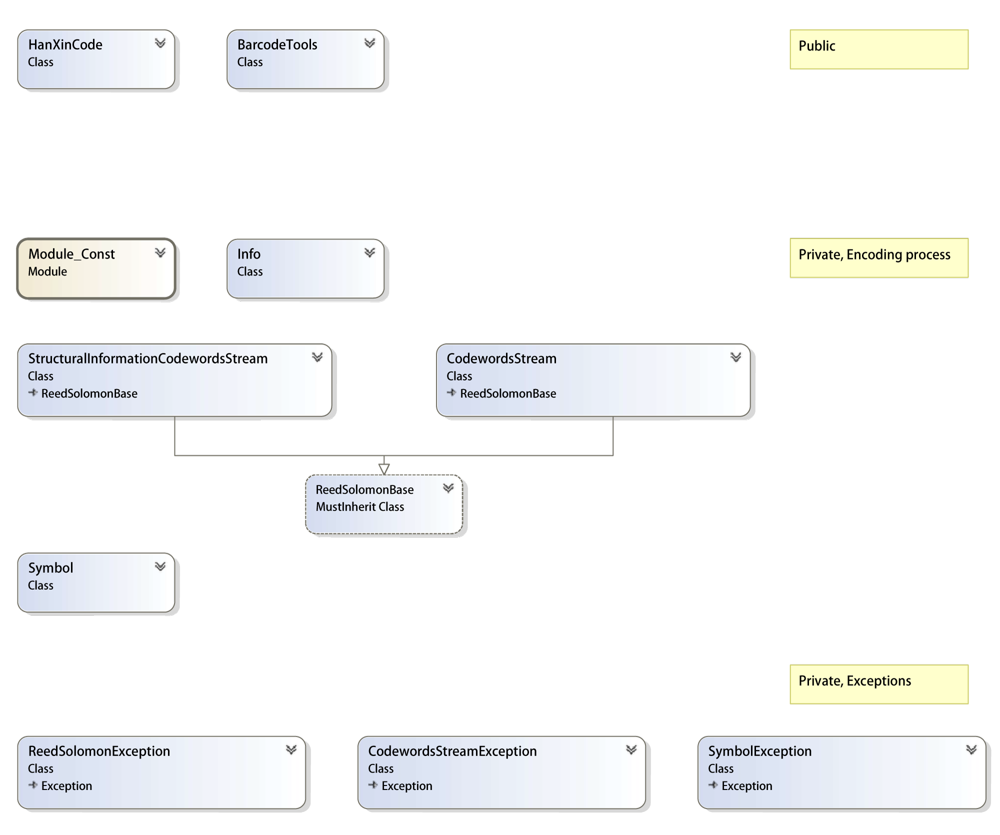

## General Information
Welcome\! This repository contains the source code for:
- [AIM International Technical Specification - Han Xin Code Encoding Library for .Net](https://github.com/benjamin-shi/AIMHanXinCode.Net/tree/master/src)
- [.Net library build projects](https://github.com/benjamin-shi/AIMHanXinCode.Net/tree/master/projects)
- [Documentations](https://github.com/benjamin-shi/AIMHanXinCode.Net/tree/master/document)
- [Windows & Console Example applications](https://github.com/benjamin-shi/AIMHanXinCode.Net/tree/master/examples)

This project is the first open source project for Han Xin Code - a Chinese National two-dimensional barcode symbology.

From 2005, Han Xin Code was invented to be a 2d barcode symbology, which can much efficiently encoded Chinese character and information into 2d barcode.

Since it is first published as Chinese National Standard (GB/T 21049), Han Xin has made its 10+ years in the journey.

## Supported standard and specification
This project contains all the encoding functionalities in:
* Han Xin's Chinese National Standard (GB/T 21049) 
* [AIM International Technical Specification - Han Xin Code](https://www.aimglobal.org/store/ViewProduct.aspx?id=4249149)

## Repository Structure
In this repository:
- [**src**](https://github.com/benjamin-shi/AIMHanXinCode.Net/tree/master/src) contains all of the source code of Han Xin encoding library.
- [**projects**](https://github.com/benjamin-shi/AIMHanXinCode.Net/tree/master/projects) contains .Net Framework, .Net Core and .Net Standard projects which can build .Net runtime libraries.
- [**document**](https://github.com/benjamin-shi/AIMHanXinCode.Net/tree/master/document) contains the documentation of these libraries.
- [**examples**]() contains windows & console examples for the library.

> All of the projects and codes are written under .Net 2.0 and it can be supported in any above .Net, .Net Core, .Net Standard, etc.

> In the source code,
> - [Han Xin Code](https://github.com/benjamin-shi/AIMHanXinCode.Net/tree/master/src/Han%20Xin%20Code) directory is the major source code for Han Xin encoding process from data to symbol matrix.
> - [BarcodeTools](https://github.com/benjamin-shi/AIMHanXinCode.Net/tree/master/src/BarcodeTools) directory contains a Utility class to format data under AIM ECI specification and bitmap generation. **_please note, .Net Core and .Net Standard and UWP may not support System.Drawing.Bitmap for bitmap generation in this class_**

> And you can find a [Class Diagram](https://github.com/benjamin-shi/AIMHanXinCode.Net/blob/master/document/ClassDiagram.png) in [**document**](https://github.com/benjamin-shi/AIMHanXinCode.Net/tree/master/document), like this:\
> 

## Communicating with the Team

The easiest way to communicate with the team is via GitHub issues. Please file new issues, feature requests and suggestions, but **DO search for similar open/closed pre-existing issues before you do**.

Please help us keep this repository clean, inclusive, and fun\!

If you would like to ask a question that you feel doesn't warrant an issue (yet), please reach out to us via Twitter:

  - Benjamin Shi: [benjamin.shi.us@gmail.com](benjamin.shi.us@gmail.com) or [shiyubnu@gmail.com](shiyubnu@gmail.com)

At last,\
I hope you will like this repository, and I heartly hope this repository can help you to understand this new-born 2d barcode.

Sincely,

Benjamin Shi (Shi Yu)\
[benjamin.shi.us@gmail.com](benjamin.shi.us@gmail.com)\
[shiyubnu@gmail.com](shiyubnu@gmail.com)
